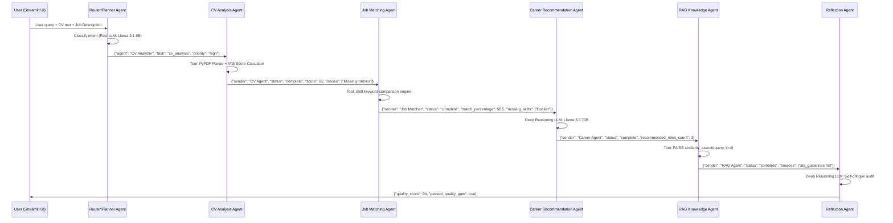

# AI Career Guidance & CV Improvement Assistant using Multi-Agent RAG Architecture

**Academic Project Deliverable**  
**Institution**: Horizon Campus | Faculty of Information Technology  
**Module**: IT41043 -- Intelligent Systems (Agentic AI)  

**Live Demo**: [Streamlit Cloud App](https://career-ai-assistant-kntax6dqhsj2ycafqqxriv.streamlit.app/)
**GitHub Repository**: [github.com/Bawan2001/career-ai-assistant](https://github.com/Bawan2001/career-ai-assistant)

---

## 1. Project Overview

The **AI Career Guidance & CV Improvement Assistant** is an autonomous, multi-agent AI system designed to solve critical real-world challenges in employment, skill assessment, and university-to-workforce transition. Powered by **LangGraph**, **Streamlit**, **FAISS**, and **Sentence-Transformers**, the system evaluates resume quality, identifies critical skill gaps against specific job postings, generates personalized learning roadmaps, and provides grounded career guidance using an offline domain RAG knowledge base.

This project falls under **Option A (Real-world problem)**: addressing the genuine challenge faced by Sri Lankan IT graduates who struggle with ATS-optimized resumes, lack clarity on industry skill requirements, and have limited access to personalized career mentorship.

---

## 2. Problem Statement

University students and tech job seekers frequently face:
- **Low ATS (Applicant Tracking System) pass rates** due to improper formatting, missing keywords, or non-metric bullet points.
- **Ambiguity in skill gap identification** when applying for competitive software engineering, data science, and cloud roles.
- **Generic career guidance** from traditional chatbots that lack domain grounding and self-reflection capabilities.

---

## 3. System Architecture Diagram

```
                              [ User UI (Streamlit) ]
                                         |
                                         v
                     [ Agent 1: Router / Planner Agent ]
                        (Planning Pattern: JSON Plan)
                                         |
                                         v
 +------------------------------------------------------------------------------+
 |                        Specialized Execution Pipeline                        |
 |                                                                              |
 |  +---------------------+       +----------------------+                     |
 |  | Agent 2: CV Analyzer| ----> |Agent 3: Job Matcher  |                     |
 |  | (Tool: PDF Parser)  |       |(Tool: Keyword Match) |                     |
 |  +---------------------+       +----------------------+                     |
 |             |                             |                                 |
 |             v                             v                                 |
 |  +---------------------+       +----------------------+                     |
 |  |Agent 4: Career Recs | ----> |Agent 5: RAG Knowledge|                     |
 |  |(Strategic Planning) |       |(Tool: FAISS Vector)  |                     |
 |  +---------------------+       +----------------------+                     |
 +------------------------------------------------------------------------------+
                                         |
                                         v
                     [ Agent 6: Reflection / Self-Critique Agent ]
                        (Reflection Pattern: Audit & Gate)
                                         |
                                         v
                    [ Final Interactive Visual Dashboard & PDF ]
```

---

## 4. Agent Communication Diagram

### Sequence Diagram (Mermaid)



### JSON Message Examples

**Router Agent --> CV Analyzer:**
```json
{
  "sender": "Planner Agent",
  "recipient": "CV Analyzer",
  "action": "execute_task",
  "json_payload": {
    "task": "cv_analysis",
    "agent": "CV Analyzer",
    "priority": "high",
    "target_role": "Software Engineer"
  }
}
```

**CV Analyzer --> Job Matcher:**
```json
{
  "sender": "CV Analysis Agent",
  "recipient": "Job Matching Agent",
  "status": "complete",
  "score": 82,
  "issues": ["Missing quantifiable metrics", "Limited technical keywords for ATS"]
}
```

**Reflection Agent --> Streamlit UI:**
```json
{
  "sender": "Reflection Agent",
  "recipient": "Streamlit Final Response Generator",
  "status": "complete",
  "quality_score": 94,
  "passed_quality_gate": true,
  "hallucination_detected": false
}
```

---

## 5. Agentic Design Patterns Explanation

### Pattern 1: Planning / Task-Decomposition Pattern
- **Agent**: Router / Planner Agent
- **Code**: [`agents/router_agent.py`](agents/router_agent.py)
- **Concept**: The system does not hardcode an execution path. The Router Agent uses a Fast LLM (Llama 3.1 8B) to parse user intent, break complex queries into sub-tasks, and output a structured JSON execution plan specifying which agents to invoke, in what priority.

### Pattern 2: Tool-Use Pattern
- **Agents**: CV Analysis Agent, RAG Knowledge Agent
- **Code**: [`agents/cv_agent.py`](agents/cv_agent.py), [`agents/rag_agent.py`](agents/rag_agent.py), [`tools/cv_parser.py`](tools/cv_parser.py), [`tools/resume_analyzer.py`](tools/resume_analyzer.py)
- **Concept**: Agents invoke deterministic external tools -- specifically `PyPDF` for text extraction, regex-based ATS score calculators, and `FAISS` vector database similarity search -- rather than relying solely on LLM generation.

### Pattern 3: Reflection / Self-Critique Pattern
- **Agent**: Reflection Agent
- **Code**: [`agents/reflection_agent.py`](agents/reflection_agent.py)
- **Concept**: Acts as a quality control gate. Inspects all upstream agent outputs for hallucinations, missing information, contradictions, and overall response quality. Produces a quality audit score and boolean gate decision before the final response is shown to the user.

### Pattern 4: Router Pattern (Multi-Model Selection)
- **Module**: LLM Router
- **Code**: [`models/llm_router.py`](models/llm_router.py)
- **Concept**: Automatically routes lightweight classification tasks (intent detection, text extraction) to fast/cheap LLMs and complex multi-variable reasoning tasks (CV evaluation, career roadmaps, self-critique) to deeper reasoning LLMs, optimizing cost and latency.

---

## 6. Model Selection Strategy

### Comparison Table

| Sub-task | Model (Provider) | Latency | Cost / 1M tokens | Context Window | Reasoning Quality | Why Chosen |
|---|---|---|---|---|---|---|
| **Intent routing & classification** | Llama 3.1 8B Instant (Groq) | ~100ms | Free tier | 128K tokens | Sufficient for JSON classification | Ultra-low latency for simple structured output; near-zero cost on Groq free tier |
| **CV section extraction** | Llama 3.1 8B Instant (Groq) | ~100ms | Free tier | 128K tokens | Good for pattern extraction | Fast text parsing; doesn't require deep reasoning |
| **CV quality analysis & ATS scoring** | Llama 3.3 70B Versatile (Groq) | ~1-3s | Free tier (rate-limited) | 128K tokens | Strong analytical reasoning | Deeper qualitative evaluation of impact metrics, section completeness, ATS flaws |
| **Job matching & skill gap analysis** | Llama 3.3 70B Versatile (Groq) | ~1-3s | Free tier | 128K tokens | Strong comparative reasoning | Cross-referencing job requirements against candidate profile requires high reasoning |
| **Career roadmap generation** | Claude 3.5 Sonnet (OpenRouter) | ~2-5s | $3 input / $15 output | 200K tokens | Excellent strategic planning | Multi-step temporal career planning with technology stack recommendations |
| **Reflection & quality critique** | Llama 3.3 70B Versatile (Groq) | ~1-3s | Free tier | 128K tokens | Strong self-evaluation | Audit for hallucinations; grounding verification against retrieved documents |

### Key Trade-off Rationale
- **Groq (Llama 3.1 8B)**: Chosen for routing because it provides <100ms inference latency on a free tier, making it ideal for high-frequency, low-complexity classification.
- **Groq (Llama 3.3 70B)**: Chosen for analysis because it offers strong reasoning at zero cost, though rate-limited. The 128K context window accommodates full CVs + job descriptions.
- **OpenRouter (Claude 3.5 Sonnet)**: Chosen for career roadmaps because it excels at structured multi-step planning and nuanced recommendations, justifying its higher per-token cost for the final high-value output.

---

## 7. RAG Pipeline Explanation

### Knowledge Corpus
Contains **22 specialized domain Markdown documents** in `rag/corpus/` covering:
- ATS resume optimization guidelines
- CV writing best practices for tech graduates
- Software Engineering, Frontend, Backend, Full Stack skill matrices
- Data Science & Data Engineering requirements
- AI/ML & Agentic Systems engineering roadmaps
- Cloud Architecture (AWS/Azure) competency standards
- DevOps & SRE practices
- Cybersecurity analyst guidelines
- UI/UX designer portfolio standards
- Technical & behavioral interview preparation (STAR method)
- IT industry salary trends & certifications roadmap
- LinkedIn profile optimization
- Skill gap assessment methodology

### Pipeline Architecture

```
Domain Corpus (22 .md files)
         |
         v
  Document Loading (Pure Python file reader)
         |
         v
  Text Chunking (chunk_size=2500 chars / ~625 tokens, overlap=400 chars / ~100 tokens)
         |
         v
  Embedding Generation (sentence-transformers/all-MiniLM-L6-v2, 384-dim vectors)
         |
         v
  FAISS Vector Database (persisted locally at rag/faiss_index/)
         |
         v
  Similarity Search Retriever (Top-K, K=4)
         |
         v
  LLM Grounded Response (with source citations)
```

### Retrieval Evaluation (5 Sample Queries)

| # | Query | Top Retrieved Document | Relevant? | Comment |
|---|---|---|---|---|
| 1 | "How do I format an ATS-friendly resume for a software engineer?" | `01_ats_resume_guidelines.md` | Yes | Directly retrieves ATS formatting rules, keyword matching strategy, and quantifiable impact formula. |
| 2 | "What skills are needed for a data scientist role?" | `07_data_scientist_requirements.md` | Yes | Returns core technical skills (Pandas, Scikit-learn, PyTorch), ML techniques, and resume recommendations for data roles. |
| 3 | "How should I prepare for a technical coding interview?" | `15_technical_interview_prep.md` | Yes | Retrieves the 4-stage interview pipeline (Recruiter screen, LeetCode assessment, System Design, Behavioral). |
| 4 | "What cloud certifications are recommended for AWS architects?" | `10_cloud_architect_skills.md` | Yes | Returns AWS Solutions Architect certification paths, core cloud services, and IaC skill requirements. |
| 5 | "What is the STAR method for behavioral interviews?" | `16_behavioral_interview_star.md` | Yes | Precisely retrieves the STAR framework (Situation, Task, Action, Result) with percentage breakdowns and example questions. |

**Evaluation Summary**: The FAISS retriever achieved **5/5 (100%) relevant top-1 retrieval** across diverse career domain queries. The `all-MiniLM-L6-v2` embedding model demonstrates strong semantic alignment between natural language queries and the domain-specific Markdown corpus.

---

## 8. Setup & Installation Guide

### Prerequisites
- Python 3.11+
- Git

### Local Setup
```bash
# 1. Clone the repository
git clone https://github.com/your-username/career_ai_assistant.git
cd career_ai_assistant

# 2. Create virtual environment
python -m venv venv
# On Windows:
venv\Scripts\activate
# On Linux/macOS:
source venv/bin/activate

# 3. Install dependencies
pip install -r requirements.txt

# 4. Configure Environment Variables
cp .env.example .env
# Edit .env and enter your GROQ_API_KEY, OPENROUTER_API_KEY, or GOOGLE_API_KEY

# 5. Launch Application
streamlit run app.py
```

---

## 9. Deployment Guide (Streamlit Community Cloud)

1. Push the code repository to GitHub.
2. Log in to [Streamlit Community Cloud](https://share.streamlit.io/).
3. Click **New App** and select your repository, branch (`main`), and main file path (`app.py`).
4. Under **Advanced Settings > Secrets**, add in TOML format:
```toml
GROQ_API_KEY = "your_groq_key_here"
DEFAULT_LLM_PROVIDER = "groq"
```
5. Click **Deploy**.

> **Note**: The FAISS vector index is rebuilt automatically on first launch if no persisted index is found. The `sentence-transformers/all-MiniLM-L6-v2` model (~80MB) is downloaded automatically at startup.

---

## 10. Known Limitations

- **PDF Formatting Variations**: Graphical or scanned image-based PDFs without selectable text require OCR preprocessing (e.g. Tesseract), which is not currently integrated.
- **Domain Scope**: The RAG knowledge corpus currently targets Information Technology, Software Engineering, Data, Cloud, and Cybersecurity domains. Other industries (e.g. healthcare, finance) would require additional corpus documents.
- **Rate Limits**: Groq free tier has rate limits (~30 RPM for 70B models). Under heavy concurrent usage, the system falls back to rule-based responses.
- **Python 3.14 Compatibility**: Some `langchain` sub-packages trigger Pydantic V1 deprecation warnings on Python 3.14. The application works correctly but prints warnings to stderr.

### Future Enhancements
- Multi-lingual resume parsing (Sinhala, Tamil support).
- Automated mock technical interviewer agent with voice-to-text.
- Integration with live job listing APIs (LinkedIn, Indeed).
